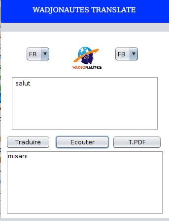

# traduction_francais_fulfude
Un mini programme programme java de traduction de français vers fulfuldé
ce programme traduit :
1 > un texte entré dans la zone de texte
2 > un document pdf
3 > synthese vocal de 1 et 2
## Traduction par dictionnaire
Nous avons deux dictionnaires, l’un en français et l’autre en fulbé representant la
traduction du prémier en gardant la même position.

 String[] motsFR={"semence","Abraham"............."bonjour"}
String[] motsFR={"aawdiiri","Ibrahim"............"awali djam"}

En gros nous avons utilisé une méthode de traduction littérale (une traduction qui respecte 
la morphologie et la syntaxe du texte original mot par mot, syntagme par syntagme ou 
phrase parphrase)un mot ne figurant pas dans le dictionnaire n’est donc pas traduit et sera donc
affiché tel qu’il est.

Les deux dictionnaires ne sont pas encore riches.

## lecture audio de la traduction
Le paquet FreeTTS contient un système de synthèse vocale
FreeTTS.jar disponible sur http://www.java2s.com/Code/Jar/f/Downloadfreettsjar.htm
## PDF to text
Pour l'extraction du texte d'un pdf nous avons utilisé le paquet pdfbox-app
disponible sur https://jar-download.com/artifacts/org.apache.pdfbox/pdfbox-app
# Le programme
 